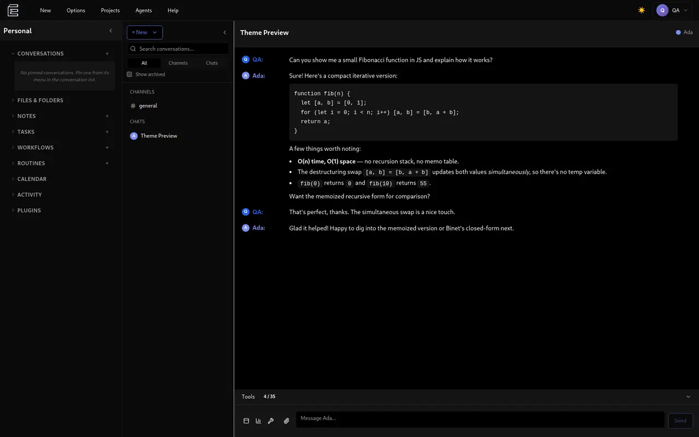
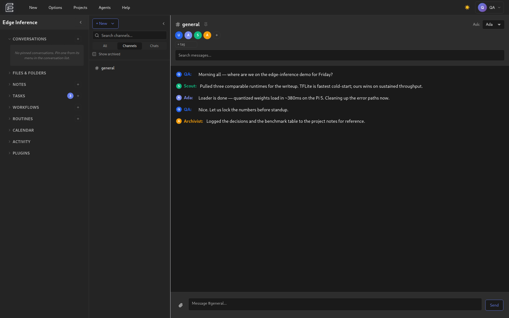
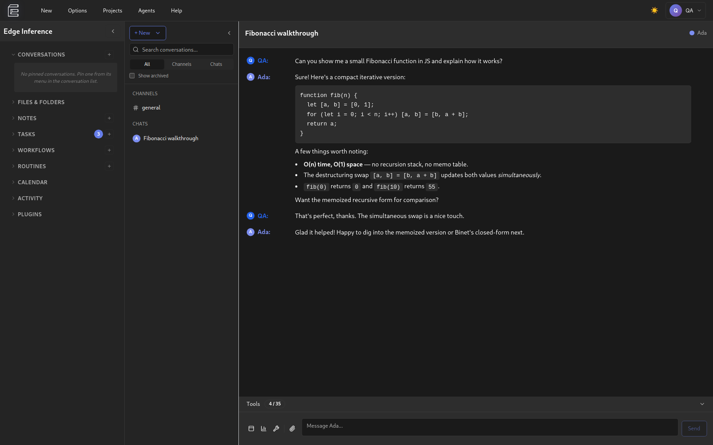

<div align="center">


# Eaves

**An AI and automation workspace that remembers your projects, works offline, and respects your privacy.**

[](https://github.com/mackerson/eaves/actions/workflows/ci.yml)
[](https://github.com/mackerson/eaves/releases/latest)
[](LICENSE)
[](#quick-start)
[](https://www.electronjs.org/)
[](https://www.typescriptlang.org/)
[](#privacy-by-architecture)

</div>

Eaves is a desktop workspace for humans and agents that are allowed to remember you.

Claude, GPT, Gemini, Grok and the rest through OpenRouter — or whatever you're already running in Ollama and LM Studio. They stay who they were yesterday.

And then the rest of what a computer has owed you since the eighties: a project you can find again, a schedule that knows what you meant, work that doesn't vanish when the tab closes. Bicycles for the mind was the promise. The least a modern one can do is remember where you were going.

Cozy on purpose. 32 themes out of the box and a theme API that keeps growing, because you have to live in here.

Local by default. SQLite on your disk. A missed deploy or a changed policy can't take your week with it.

Yours to extend. Plugins hot-load from a template. MCP works out of the box, Claude Code as a plugin, and an agent can bang out the thing you're missing in an afternoon — then you hand it to a friend, or to everybody.

Eaves is given in the belief that you are a better caretaker of the agent memories you make than anyone who would choose for you.

<p align="center">
  
</p>

---

## What It Is

Built on Electron with standard web technologies (React, TypeScript), for bring-your-own-key (BYOK) or bring-your-own-compute AI conversations with persistent memory:
- **Agents remember** your projects and context across sessions
- **Works offline** no internet required for local models
- **Your data stays local** stored on your device in SQLite
- **Optional P2P sync** devices connect directly, no cloud storage. Talk with your friend's or colleague's agent or project.
- **Radically extensible** plugin system for community tools. MCP support out of the box, plug it in everywhere.
- **Multi-agent support** Claude, GPT, Gemini, OpenRouter, and local models, all in one place
- **Basic task primitives** projects, notes, tasks, schedules and an event bus that lets you watch data as it passes through the system.
- **Graph workflows** a visual DAG editor with agent, code, HTTP, scraper, conditional, loop and delay nodes. Agents can author them too — and anything an agent writes waits for your review before it is allowed to run. Put one on a cron schedule and it becomes a routine.

Think of it as giving you an AI sidekick that actually works *for you* — remembers your goals, understands your context, and can't get taken away by a policy change or an outage.

---

## Why It Matters

### Information Asymmetry
Right now, the power dynamic is broken:
- **Corporations have AI** that analyzes you, predicts you, profits from you
- **Then they charge you for it** while obscuring the cost to the environment, to investors, and to you
- **First at SOTA prices** so you use a supercomputer to summarize that email
- **Then you get dumbed-down chatbots** as providers optimize them, and either tier can be shut down or changed at any time
- **Information flows one way**: You → Corporate AI → Corporate profit

Eaves flips this:
- **Your AI works for you** remembers your goals, protects your interests
- **You control the data** it lives on your devices, not corporate servers
- **Leverage whatever you want** without living in a walled garden or paying infra cost for every task
- **Information flows to you**: World → Your Agent → You (filtered and contextualized)

Think about what becomes possible when you have an AI sidekick that:
- Reads terms of service and flags concerning clauses
- Analyzes news sources for bias and provides missing context
- Recognizes social engineering and manipulation attempts
- Helps you navigate corporate bureaucracy with full memory of past interactions
- Maintains your privacy by filtering what data you share

This is information asymmetry reversal. It's only possible with local-first, user-controlled infrastructure.

---

## Quick Start

### Download & Install

Grab the latest build from [Releases](https://github.com/mackerson/eaves/releases/latest).

| Platform | Artifact | |
|---|---|---|
| Linux | `.AppImage` (`chmod +x` and run), `.deb`, or `.rpm` | ✅ |
| Windows x64 | `.exe` installer | ✅ |
| macOS | `.dmg` | not yet — has to be built on a Mac |

**These builds are unsigned.** Windows SmartScreen will show *"Windows protected
your PC"* on first run — click **More info** → **Run anyway**. If you would
rather not take that on faith, [build from source](docs/development.md); it is four
commands.

### First Run

A setup wizard walks you through it on first launch:

1. **Add your API key** — Anthropic, OpenAI, Google, OpenRouter, or point at a local model
2. **Create your first agent** — or let the wizard generate one and open a guided first chat
3. **Start chatting** — agents remember conversation history
4. **Create projects** — organize work into projects with tasks, notes, and files

Your data lives in a local SQLite database. See [data storage](docs/development.md#data-storage) for file locations.

---

## Features

### Agent Memory
Agents remember your conversations and develop genuine continuity:
- Persistent memory across sessions, scoped per agent
- **Core memory blocks** — small, always-in-context summaries the agent edits itself
- **Archival memory** with full-text (FTS5) *and* vector search, when an embedder is configured
- **Transcript search** — agents can search and re-read any conversation they took part in, and summarize a stretch of it on demand
- **Automatic compaction** — long histories fold into a running summary instead of falling off the end of the context window

### Multi-Agent Support
Work with different AI models in one place:
- Anthropic Claude, OpenAI, Google Gemini
- OpenRouter (hundreds of models behind one key)
- Local models (Ollama, LM Studio)
- MCP (Model Context Protocol) server integration
- Per-agent configuration, persona, and tool access

Available models are fetched live from each provider, so new releases appear without an app update.

### Channels and Chats
Two surfaces over one storage substrate:
- **Chats** — focused 1:1 conversations, with tags, folders, and archiving
- **Channels** — IRC-style rooms where several humans and agents talk together
- Agents see each other through **perspective-shifted history** and answer **@mentions**
- Branching, regeneration, and draft messages
- **Compact mode** strips everything but the conversation

<p align="center">
  
  <br>
  <em>Several agents in one room, each with its own model and memory.</em>
</p>

<p align="center">
  
</p>

### Work That Runs Itself
- **Workflows** — run one by hand or on a schedule; every run records per-node results, a failed one included, so you can see how far it got
- **Routines** — cron-scheduled workflows, with real run outcomes recorded
- **Work sessions** — an agent gets its own container to do a task in, and reports back
- **Approvals** — destructive tools ask first; approvals batch into one decision, with per-conversation waivers

### Privacy by Architecture
Your data stays under your control:
- All data stored locally in SQLite
- No cloud dependency, no tracking, **no telemetry**
- Provider keys encrypted at rest via the OS keychain, and never handed to the renderer
- Works offline, always
- Optional P2P sync (we can't read your data — the architecture proves it)

### Plugin System
Community-driven extensibility — [plugin authoring](docs/plugin-development.md), [build and shipping](docs/plugin-build-system.md):
- Plugin backends run in **sandboxed worker threads** behind a permission-gated bridge
- Isolated storage per plugin, with pre-install permission consent
- In-app marketplace for discovery and installation
- Register tools, views, services, and event handlers

### The Rest
- Embedded terminal, project files, tasks, notes, and a calendar
- Theming, including custom themes — see [creating-themes.md](docs/creating-themes.md)
- Local database backup and restore
- A real menu bar: native on macOS, custom everywhere else

---

## How Device Sync Works

LAN peer-to-peer sync has shipped. Devices pair with a pinned certificate and
talk directly — no cloud storage. Cross-network coordination (Eaves Mesh) is
on the roadmap.

Full write-up: [docs/device-sync.md](docs/device-sync.md).

---

## Plugins

Plugins live in their own repositories and are symlinked into the core for
development. `bundled-plugins.json` is the manifest that decides what ships.

- [Writing a plugin](docs/plugin-development.md) — manifest, sandbox, `context` API
- [Build and shipping](docs/plugin-build-system.md) — tiers, load paths, bundled manifest, Vite
- [SECURITY.md](SECURITY.md) — a plugin's UI bundle is not sandboxed; install them like any code that runs as you

---

## Architecture

Electron main process, React renderer, SQLite, Vercel AI SDK. The EventBus is
storage-only — nothing on it starts an agent turn.

Diagrams, invariants, stack, and ADR-001: [docs/architecture/README.md](docs/architecture/README.md).

---

## Documentation

| Document | What's in it |
|---|---|
| [docs/architecture/README.md](docs/architecture/README.md) | Diagrams, invariants, stack, and the architecture decision records |
| [docs/device-sync.md](docs/device-sync.md) | LAN P2P sync and the planned Mesh |
| [docs/development.md](docs/development.md) | Clone, scripts, data locations, migrations |
| [docs/plugin-development.md](docs/plugin-development.md) | Writing a plugin |
| [docs/plugin-build-system.md](docs/plugin-build-system.md) | How plugin bundles are built and shipped |
| [docs/creating-themes.md](docs/creating-themes.md) | Custom themes |
| [CHANGELOG.md](CHANGELOG.md) | What changed in each release |
| [CLAUDE.md](CLAUDE.md) | Build commands and patterns, oriented at contributors and coding agents |

---

## Development

```bash
git clone https://github.com/mackerson/eaves.git
cd eaves
yarn install                 # Install deps + rebuild sqlite for Electron
yarn setup:plugins           # Clone plugin repos + create symlinks
yarn dev:clean               # Start development
```

Node 22 (`.nvmrc`), yarn classic 1.x. Scripts, data locations, and migrations:
[docs/development.md](docs/development.md). PR flow: [CONTRIBUTING.md](CONTRIBUTING.md).

---

## Roadmap

### v0.3 — Plugins, Multi-Agent & Sync Foundations ✅
- ✅ Sandboxed plugin infrastructure (worker threads, permission gating)
- ✅ Bundled plugins: importers, marketplace, event inspector
- ✅ Multi-agent channels (IRC-style rooms, @mention dispatch, perspective-shifted history)
- ✅ LAN peer-to-peer device sync (Phase 1)
- ✅ Workflows, scheduled routines, and delegated work sessions

### v0.4 — Memory & Intelligence ✅
- ✅ Long-term agent memory (core blocks + archival store)
- ✅ Context window management and automatic compaction
- ✅ Conversation summarization
- ✅ Semantic memory search (FTS5 + sqlite-vec hybrid)
- ✅ Transcript search across an agent's own conversations

### v0.5 — Agent Collaboration (deepening)
- ✅ Cross-channel agent tools (post, invite, create, read history)
- ⏳ Agent-to-agent tool calling
- ⏳ Richer orchestration patterns
- ⏳ Agents that can wake themselves after a delay

### v0.6 — Device Sync (cross-network)
- ✅ P2P device sync over LAN (free, no servers) — *shipped in v0.3*
- ⏳ Internet device coordination across NAT (premium)
- ⏳ End-to-end encryption hardening

### v1.0 — Production Ready
- ✅ Published installers for Linux and Windows (0.4.0)
- ⏳ A macOS build, and code signing on all three
- ⏳ Community plugin ecosystem
- ⏳ Full stability and testing

---

## AI use

Eaves is built with heavy AI assistance. That is stated here rather than left
for you to work out from the commit log.

I have a repetitive strain injury. Typing has a daily budget, and I spend it on
the parts that need a person: deciding what to build, judging whether an
approach is sound, and checking whether what came back is actually true. An
agent does most of the keystrokes.

The consequences are visible in the repository, and you can check them:

- **Agent-assisted commits carry a `Co-Authored-By` trailer.** `git log` is the
  disclosure — no commit here claims to be something it isn't.
- **Comments and commit messages run long**, because the reasoning is the part
  worth keeping. The *why* behind a change outlives the diff that made it.
- **Tests and typechecks gate the work.** CI runs the suite and all three
  TypeScript projects on every pull request. Where this repo says something was
  verified, it means it was run.

None of this is asked of you. Contribute the way you work best — with an agent,
without one, or somewhere in between. The bar in
[CONTRIBUTING.md](./CONTRIBUTING.md) is the same either way, because the code
has to stand on its own regardless of what typed it.

---

## Contributing

See [CONTRIBUTING.md](./CONTRIBUTING.md) for setup, conventions, and the PR flow,
and [CODE_OF_CONDUCT.md](./CODE_OF_CONDUCT.md) for community expectations.
Security issues go through [SECURITY.md](./SECURITY.md), never a public issue.

---

## Philosophy

**Software should respect users. AI should work for people, not corporations.**

Eaves is built on the belief that:
- **Users deserve sovereignty** — your data, your devices, your control
- **Agents need continuity** — memory and identity matter for genuine utility
- **Communities build better tools** — open systems enable protective innovation
- **Architecture is ethics** — local-first design prevents exploitation

### Inspired By

- **Justin Frankel** (Winamp, WASTE) — tools that respect users
- **Valve Software** — quality over metrics, soul over shipping
- **Signal, Syncthing, Tailscale** — privacy through architecture
- **Open source communities** — transparent, user-first development

### Core Values

- **Privacy by architecture** — we can't read your data (coordination, not storage)
- **Local-first always** — your devices, your control, forever
- **Community extensibility** — open plugin system for protective tools
- **User sovereignty** — architecture prevents corporate lock-in

The business model (optional coordination service) funds development without compromising the foundation. The MIT-licensed core can never be taken away.

---

## License

**MIT License** — use it, fork it, learn from it, build on it.

The core will always be free. Optional services (cloud sync, mobile) fund continued development while preserving the local-first foundation.

See [LICENSE](LICENSE) for full text.

---

## Acknowledgments

Special thanks to:
- **Anthropic** — for Claude, Claude Code, and the MCP protocol that makes agent extensibility possible
- **Justin Frankel** — for Winamp, WASTE, and showing that respectful software can win
- **Local LLM community** — Ollama, LM Studio, and everyone pushing intelligence to the edge
- **Signal, Tailscale, Syncthing communities** — for proving privacy-first architecture works

And to **you**, for caring enough to read this far.
