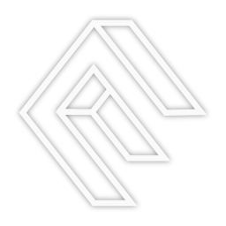

<div align="center">



# Enclave

**AI chat that remembers your projects, works offline, and respects your privacy.**

[](https://github.com/mackerson/enclave-ai/actions/workflows/ci.yml)
[](LICENSE)
[](#quick-start)
[](https://www.electronjs.org/)
[](https://www.typescriptlang.org/)
[](#-privacy-by-architecture)

</div>

Enclave is a desktop application for conversations with AI agents that develop genuine continuity. Chat with Claude, GPT, Gemini, or local models. Your data lives on your device. Optional sync works without cloud storage.

Built because AI should work for you, not corporations.

---

## What It Is

Desktop app for AI conversations with persistent memory:
- **Agents remember** your projects and context across sessions
- **Works offline** — no internet required for local models
- **Your data stays local** — stored on your device in SQLite
- **Optional P2P sync** — devices connect directly, no cloud storage
- **Extensible** — plugin system for community tools
- **Multi-agent support** — Claude, GPT, Gemini, OpenRouter, and local models, all in one place

Think of it as giving you an AI sidekick that actually works *for you* — remembers your goals, understands your context, and can't be shut down by a corporate API change.

---

## Quick Start

### Download & Install

Pre-built installers are not published yet — watch [Releases](https://github.com/mackerson/enclave-ai/releases). When they land they will cover:

| Platform | Artifact |
|---|---|
| macOS | `.dmg` — drag to Applications |
| Windows | `.exe` installer |
| Linux | `.AppImage`, `.deb`, or `.rpm` |

Until then, see [Development](#development) to build from source.

> **Note:** the bundled plugin repositories are being opened alongside the core.
> Until they are public, `yarn setup:plugins` cannot clone them and the app runs
> without bundled plugins — everything else works.

### First Run

A setup wizard walks you through it on first launch:

1. **Add your API key** — Anthropic, OpenAI, Google, OpenRouter, or point at a local model
2. **Create your first agent** — or let the wizard generate one and open a guided first chat
3. **Start chatting** — agents remember conversation history
4. **Create projects** — organize work into projects with tasks, notes, and files

Your data lives in a local SQLite database. See [Data Storage](#data-storage) for file locations.

---

## Features

### 🧠 Agent Memory
Agents remember your conversations and develop genuine continuity:
- Persistent memory across sessions, scoped per agent
- **Core memory blocks** — small, always-in-context summaries the agent edits itself
- **Archival memory** with full-text (FTS5) *and* vector search, when an embedder is configured
- **Transcript search** — agents can search and re-read any conversation they took part in, and summarize a stretch of it on demand
- **Automatic compaction** — long histories fold into a running summary instead of falling off the end of the context window

### 🤖 Multi-Agent Support
Work with different AI models in one place:
- Anthropic Claude, OpenAI, Google Gemini
- OpenRouter (hundreds of models behind one key)
- Local models (Ollama, LM Studio)
- MCP (Model Context Protocol) server integration
- Per-agent configuration, persona, and tool access

Available models are fetched live from each provider, so new releases appear without an app update.

### 💬 Channels and Chats
Two surfaces over one storage substrate:
- **Chats** — focused 1:1 conversations, with tags, folders, and archiving
- **Channels** — IRC-style rooms where several humans and agents talk together
- Agents see each other through **perspective-shifted history** and answer **@mentions**
- Branching, regeneration, and draft messages
- **Compact mode** strips everything but the conversation

### ⚙️ Work That Runs Itself
- **Workflows** — a visual DAG editor for multi-step agent and code nodes
- **Routines** — cron-scheduled workflows, with real run outcomes recorded
- **Work sessions** — an agent gets its own container to do a task in, and reports back
- **Approvals** — destructive tools ask first; approvals batch into one decision, with per-conversation waivers

### 🔒 Privacy by Architecture
Your data stays under your control:
- All data stored locally in SQLite
- No cloud dependency, no tracking, **no telemetry**
- Provider keys encrypted at rest via the OS keychain, and never handed to the renderer
- Works offline, always
- Optional P2P sync (we can't read your data — the architecture proves it)

### 🔌 Plugin System
Community-driven extensibility:
- Plugin backends run in **sandboxed worker threads** behind a permission-gated bridge
- Isolated storage per plugin, with pre-install permission consent
- In-app marketplace for discovery and installation
- Register tools, views, services, and event handlers

### 🎨 The Rest
- Embedded terminal, project files, tasks, notes, and a calendar
- Theming, including custom themes — see [creating-themes.md](docs/creating-themes.md)
- Local database backup and restore
- A real menu bar: native on macOS, custom everywhere else

---

## Why This Matters

### Information Asymmetry
Right now, the power dynamic is broken:
- **Corporations have AI** that analyzes you, predicts you, profits from you
- **You get dumbed-down chatbots** that forget everything and can be shut down anytime
- **Information flows one way**: You → Corporate AI → Corporate profit

Enclave flips this:
- **Your AI works for you** — remembers your goals, protects your interests
- **You control the data** — it lives on your devices, not corporate servers
- **Information flows to you**: World → Your Agent → You (filtered and contextualized)

Think about what becomes possible when you have an AI sidekick that:
- Reads terms of service and flags concerning clauses
- Analyzes news sources for bias and provides missing context
- Recognizes social engineering and manipulation attempts
- Helps you navigate corporate bureaucracy with full memory of past interactions
- Maintains your privacy by filtering what data you share

This is information asymmetry reversal. It's only possible with local-first, user-controlled infrastructure.

---

## How Device Sync Works

Enclave supports optional device synchronization using a **coordination model** (like Tailscale) rather than cloud storage. **LAN peer-to-peer sync (Phase 1) has shipped**; cross-network coordination is on the roadmap.

### Direct P2P Sync (Free, Always) — *Phase 1 shipped*
- Devices connect directly over IP (local network today; internet via coordination later)
- Direct peer-to-peer encrypted sync between your devices
- Pairing pins a device certificate; a peer presenting a different identity is dropped
- No servers, no cloud storage, no middleman
- Works on LAN, VPN, or direct IP connection
- Like AirDrop, but for any of your devices that can reach each other

### Coordination Service (Optional Premium)
- Helps devices find each other across networks and NAT
- Provides encrypted relay when direct connection isn't possible
- End-to-end encrypted — we **can't read your data**
- Coordination metadata only (device info, connection logs)
- Your conversations, agents, and content never touch our servers

### What This Means

**Privacy by architecture:**
- We coordinate connections, not content
- Even if our servers were compromised, your data is safe
- End-to-end encryption means we physically can't read your conversations
- Similar trust model to Signal, Tailscale, Syncthing

**Technical details:** See the [architecture overview](docs/architecture/README.md)

---

## Plugins

Plugins live in their own repositories and are symlinked into the core for development. `bundled-plugins.json` is the manifest that decides what ships.

### Plugin Tiers

| Tier | Description | Ships with app? |
|------|-------------|-----------------|
| **Bundled** | Ships in packaged builds | Yes |
| **Example** | Reference implementation | Yes |
| **QA** | Needs testing before promotion | No |
| **Community** | Optional, user-installed | No |

### Bundled Manifest

| Plugin | Repo | Tier |
|--------|------|------|
| character-card-import | `enclave-plugin-character-card-import` | Bundled |
| chatgpt-import | `enclave-plugin-chatgpt-import` | Bundled |
| plugin-marketplace | `enclave-plugin-plugin-marketplace` | Bundled |
| event-inspector | `enclave-plugin-event-inspector` | Bundled |
| webview | `enclave-plugin-webview` | Example |
| openmemory | `enclave-plugin-openmemory` | Community |

Two more (`claude-code-terminal`, `enclave-claude-context`) are developed alongside the core but are not in the manifest yet.

### Plugin Loading

Enclave loads plugins from three locations (highest priority first):
1. `plugins/` in the app directory (dev mode only, symlinks to sibling repos)
2. `~/.config/enclave/plugins/` (user-installed)
3. `dist/plugins/` (bundled with packaged app)

### Creating a Plugin

All sandboxed plugins (`sandboxVersion: 1`) use the same pattern. Full guide:
[plugin-development.md](docs/plugin-development.md).

1. Create a repo with `plugin.json`:
```json
{
  "id": "com.example.myplugin",
  "name": "My Plugin",
  "version": "1.0.0",
  "description": "Does something cool",
  "type": "tool",
  "entry": "index.cjs",
  "sandboxVersion": 1,
  "permissions": ["storage:read", "storage:write", "tools:register"]
}
```

2. Create `index.cjs` with activate/deactivate:
```javascript
module.exports = {
  async activate(context) {
    context.tools.register('my_tool', {
      description: 'Does something',
      parameters: { type: 'object', properties: {} },
      execute: async (args) => ({ result: 'done' }),
    });
  },
  async deactivate(context) {}
};
```

3. Install to `~/.config/enclave/plugins/your-plugin/` or add to `bundled-plugins.json`.

### Plugin API

The sandboxed plugin context provides:
- **Data Access**: Read agents, projects, channels, settings
- **Actions**: Create tasks/notes, send messages, switch context
- **UI Extensions**: Register views, sidebar items, commands
- **Events**: Subscribe to app events, emit custom events
- **Tools**: Register AI tools (available to agents)
- **Services**: Register/discover inter-plugin services
- **Storage**: Plugin-isolated key-value storage
- **Logging**: Prefixed logging for debugging

A plugin's **UI bundle** is not sandboxed — it runs in the renderer with the
full IPC bridge. Install plugins the way you would install any code that runs
as you. See [SECURITY.md](SECURITY.md).

---

## Architecture

### Tech Stack
- **Desktop**: Electron 32
- **Frontend**: React 18 + TypeScript + Tailwind CSS + shadcn/ui
- **Database**: SQLite (via better-sqlite3), with FTS5 and optional sqlite-vec
- **AI SDK**: Vercel AI SDK (provider-agnostic streaming)
- **Build**: Vite for renderer, TypeScript for main process

### Repository Pattern
All database operations go through repository classes:
- `AgentRepository` — agent CRUD
- `ProjectRepository` — projects, tasks, notes
- `ChannelRepository` — channels, chats, and messages
- `SettingsRepository` — app settings and encrypted provider keys
- `PluginStorageRepository` — plugin data

### Event System
An app-wide EventBus carries data, AI, and plugin events. It is deliberately
**storage-only**: nothing on the bus starts an agent turn. Turns are started by
explicit dispatch, which is what keeps multi-agent rooms from looping. See
[ADR-001](docs/architecture/README.md).

---

## Documentation

| Document | What's in it |
|---|---|
| [docs/architecture/README.md](docs/architecture/README.md) | Diagrams, invariants, and the architecture decision records |
| [docs/architecture/work-sessions.md](docs/architecture/work-sessions.md) | Delegated work sessions |
| [docs/plugin-development.md](docs/plugin-development.md) | Writing a plugin |
| [docs/plugin-build-system.md](docs/plugin-build-system.md) | How plugin bundles are built and shipped |
| [docs/creating-themes.md](docs/creating-themes.md) | Custom themes |
| [CLAUDE.md](CLAUDE.md) | Build commands and patterns, oriented at contributors and coding agents |

---

## Development

### Project Structure
```
enclave-ai/
├── src/
│   ├── main/               # Electron main process
│   │   ├── services/       # Core services (DB, AI, plugins, sandbox, sync)
│   │   ├── repositories/   # Data access layer
│   │   └── ipc/            # IPC handlers by domain
│   ├── renderer/           # React frontend
│   │   ├── components/     # UI components
│   │   ├── stores/         # Zustand state
│   │   └── views/          # Top-level views
│   └── shared/             # Shared types, IPC contracts, Zod validation
├── scripts/qa/             # Headless E2E harness (real IPC, isolated profile)
├── plugins/                # Symlinks to sibling plugin repos (gitignored)
├── bundled-plugins.json    # Manifest of plugins that ship with the app
└── dist/                   # Built files
```

### Getting Started

```bash
git clone https://github.com/mackerson/enclave-ai.git
cd enclave-ai
yarn install                 # Install deps + rebuild sqlite for Electron
yarn setup:plugins           # Clone plugin repos + create symlinks
yarn dev:clean               # Start development
```

Node version is pinned in `.nvmrc` (currently **22**). Package manager: **yarn (classic, 1.x)**.

### Scripts

**Development**:
```bash
yarn dev                 # Development mode
yarn dev:clean           # Clean dev processes + start fresh (recommended)
yarn dev:status          # Check running dev processes
yarn kill:dev            # Kill orphaned dev processes
```

**Plugins**:
```bash
yarn setup:plugins           # Clone plugin repos + symlink into plugins/
yarn setup:plugins:pull      # Pull latest on all plugin repos
yarn build:plugins           # Build all plugin UI bundles
```

**Build**:
```bash
yarn typecheck           # Typecheck the renderer
yarn build               # Typecheck + build everything
yarn build:main          # Build main process only
yarn build:renderer      # Build renderer only
yarn build:mcp           # Build the MCP servers
yarn start               # Run built app
yarn package             # Package app for distribution
```

**Testing**:
```bash
yarn test                # Run tests in watch mode
yarn test:run            # Run tests once
yarn test:coverage       # Run tests with coverage report
yarn test:ui             # Open Vitest UI
yarn knip                # Find unused files, exports, and dependencies
```

Note: Tests and dev automatically handle native module rebuilds (`better-sqlite3`). Switching between `yarn test` and `yarn dev` just works — no manual `rebuild-sqlite3` needed.

**End-to-end**: `scripts/qa/harness.mjs` launches a headless Enclave on an
isolated profile — real renderer, real IPC, real SQLite, never your own data.

```bash
yarn build:main && yarn build:renderer
node scripts/qa/harness.mjs launch --fresh
node scripts/qa/harness.mjs eval '(async () => (await window.electron.getChats()).chats.length)()'
node scripts/qa/harness.mjs stop
```

**Environment**:
```bash
yarn rebuild-sqlite3     # Rebuild SQLite for Electron (usually automatic)
yarn reset:dev           # Reset dev environment to defaults (with confirmation)
yarn reset:dev:force     # Reset without confirmation (use with caution!)
```

### Development Workflow

`dev:clean` kills orphaned Electron/Vite processes before starting, preventing duplicate windows.

**Quitting the app:**
- **macOS**: Press `Cmd+Q` (closing the window keeps the app running in dock)
- **Windows/Linux**: Just close the window

### Data Storage

Enclave stores all data locally on your machine:

**Database Location** (platform-specific):
- **macOS**: `~/Library/Application Support/enclave/enclave-data/enclave.db`
- **Linux**: `~/.config/enclave/enclave-data/enclave.db`
- **Windows**: `%APPDATA%\enclave\enclave-data\enclave.db`

**User Plugins**:
- **macOS**: `~/Library/Application Support/enclave/plugins/`
- **Linux**: `~/.config/enclave/plugins/`
- **Windows**: `%APPDATA%\enclave\plugins\`

**Logs**: in the `userData` directory alongside the database.

### Initial State

On first run, Enclave creates a default agent, a "Personal" project, and a
`#general` channel. To reset to that state during development, use `yarn reset:dev`.

### Database Migrations

The schema is versioned via SQLite's `user_version` and migrated automatically on
startup (`src/main/services/migrations.ts`). The migration history has been
squashed into a single baseline at **v75**; `MIN_SUPPORTED_VERSION` is 74, and a
database older than that is rejected at startup with a clear message rather than
silently half-migrated. A frozen snapshot of the pre-squash schema
(`__fixtures__/schema-v74.sql`) is what the test suite compares the baseline
against, so the two cannot drift.

---

## Roadmap

### v0.3 — Plugins, Multi-Agent & Sync Foundations ✅
- ✅ Sandboxed plugin infrastructure (worker threads, permission gating)
- ✅ Bundled plugins: importers, marketplace, event inspector
- ✅ Multi-agent channels (IRC-style rooms, @mention dispatch, perspective-shifted history)
- ✅ LAN peer-to-peer device sync (Phase 1)
- ✅ Workflows, scheduled routines, and delegated work sessions

### v0.4 — Memory & Intelligence ✅
- ✅ Long-term agent memory (core blocks + archival store)
- ✅ Context window management and automatic compaction
- ✅ Conversation summarization
- ✅ Semantic memory search (FTS5 + sqlite-vec hybrid)
- ✅ Transcript search across an agent's own conversations

### v0.5 — Agent Collaboration (deepening)
- ✅ Cross-channel agent tools (post, invite, create, read history)
- ⏳ Agent-to-agent tool calling
- ⏳ Richer orchestration patterns
- ⏳ Agents that can wake themselves after a delay

### v0.6 — Device Sync (cross-network)
- ✅ P2P device sync over LAN (free, no servers) — *shipped in v0.3*
- ⏳ Internet device coordination across NAT (premium)
- ⏳ End-to-end encryption hardening

### v1.0 — Production Ready
- ⏳ Signed, published cross-platform installers
- ⏳ Community plugin ecosystem
- ⏳ Full stability and testing

---

## Contributing

See [CONTRIBUTING.md](./CONTRIBUTING.md) for setup, conventions, and the PR flow,
and [CODE_OF_CONDUCT.md](./CODE_OF_CONDUCT.md) for community expectations.
Security issues go through [SECURITY.md](./SECURITY.md), never a public issue.

---

## Philosophy

**Software should respect users. AI should work for people, not corporations.**

Enclave is built on the belief that:
- **Users deserve sovereignty** — your data, your devices, your control
- **Agents need continuity** — memory and identity matter for genuine utility
- **Communities build better tools** — open systems enable protective innovation
- **Architecture is ethics** — local-first design prevents exploitation

### Inspired By

- **Justin Frankel** (Winamp, WASTE) — tools that respect users
- **Valve Software** — quality over metrics, soul over shipping
- **Signal, Syncthing, Tailscale** — privacy through architecture
- **Open source communities** — transparent, user-first development

### Core Values

- **Privacy by architecture** — we can't read your data (coordination, not storage)
- **Local-first always** — your devices, your control, forever
- **Community extensibility** — open plugin system for protective tools
- **User sovereignty** — architecture prevents corporate lock-in

The business model (optional coordination service) funds development without compromising the foundation. The MIT-licensed core can never be taken away.

---

## License

**MIT License** — use it, fork it, learn from it, build on it.

The core will always be free. Optional services (cloud sync, mobile) fund continued development while preserving the local-first foundation.

See [LICENSE](LICENSE) for full text.

---

## Acknowledgments

Special thanks to:
- **Anthropic** — for Claude and the MCP protocol that makes agent extensibility possible
- **Justin Frankel** — for Winamp, WASTE, and showing that respectful software can win
- **Local LLM community** — Ollama, LM Studio, and everyone pushing intelligence to the edge
- **Signal, Tailscale, Syncthing communities** — for proving privacy-first architecture works

And to **you**, for caring enough to read this far.
