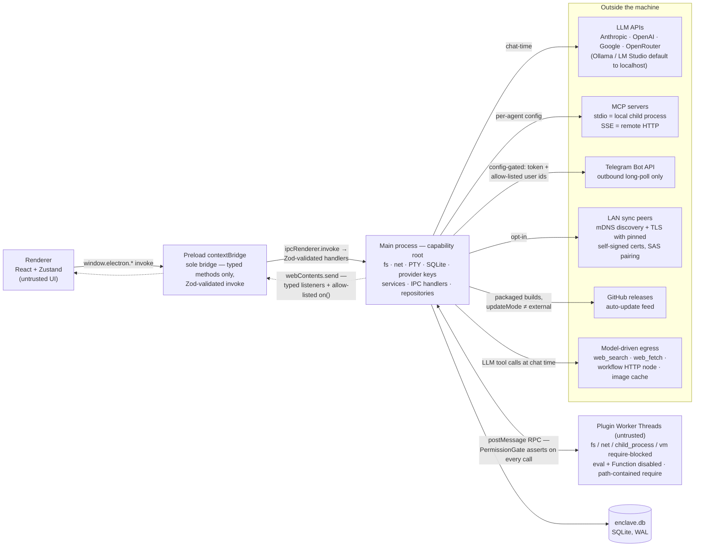
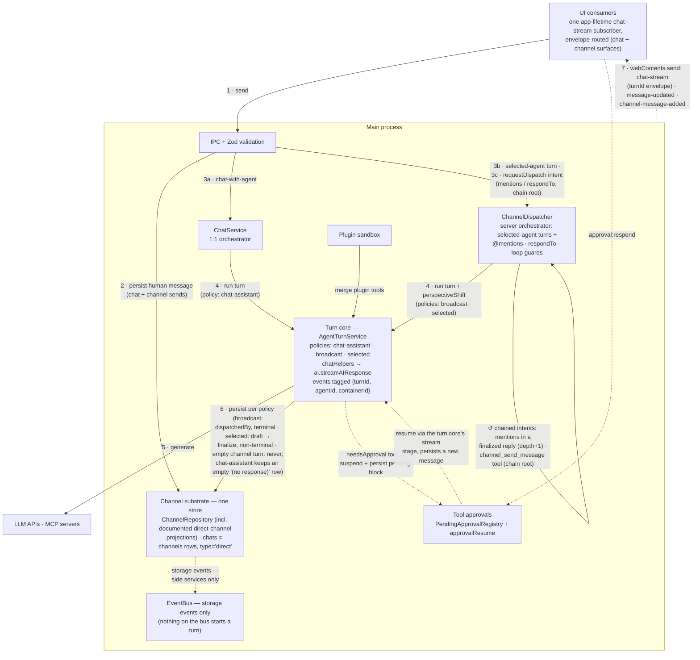

# Enclave Architecture

Enclave is a local-first Electron app for multi-agent AI conversations. This
page is the diagram home: two layered diagrams plus the invariants that make
them true. It is deliberately **not** a full service map — deep topics are
linked at the bottom, and implementation constants live in code, not in boxes.

Solid arrows are invoke/call paths; dotted arrows are async pushes. Every
claim on this page was verified against source on 2026-07-14 and re-verified
and corrected on 2026-07-17 (post-cleanup: deletion events, dropped plugin
actions, `plugin:event` gating).

## Process & trust

What runs where, and who is trusted. Main is the capability root; the
renderer and plugin workers are untrusted; preload is the only bridge.

Reading notes for this diagram:

- **Push traffic crosses preload through two mechanisms, not one**: ~10 typed
  dedicated listeners bound to literal channel names (`chat-stream`,
  `message-updated`, `channel-message-added`, `channels-changed`,
  `agents-changed`, `activity:new`, …) registered directly in `preload.ts`,
  plus a generic `on()`/`once()` gated by an allow-list (exact-match set +
  prefixes `terminal:`, `theme:`, `sync:`, import channels). Both are
  main→renderer only.
- **Externals are gated differently**: LLM/MCP fire at chat time per agent
  config; Telegram and LAN sync are constructed at startup but open no
  connection until explicitly configured/enabled; the updater runs only in
  packaged builds and never downloads without user action. Model-driven
  egress (`web_search`, `web_fetch`) is initiated by LLM tool calls, a
  different trust category from app-code-driven I/O.
- **PTY is local**: TerminalManager spawns local shells via node-pty; it is
  main-process capability, not a network surface.

## Message & multi-agent runtime

How a user message becomes an agent reply — 1:1 and multi-agent converge on
one AI stack and one storage substrate. Numbered labels trace the happy path;
the ↺ edge is the intentional re-entry cycle that makes agent-to-agent
communication work.

Reading notes for this diagram:

- **Two thin orchestrators over one turn core** (collapse plan Phases 1–2,
  ADR-001). `AgentTurnService` owns the pipeline — history (perspective-
  shifted for channels), toolset + prompt, tagged streaming, persistence per
  policy — and ChatService / ChannelDispatcher / `approvalResume` are its
  callers. Dispatch is an explicit `requestDispatch(intent)` call:
  producers are `send-message` (chain root; selected sends produce a
  single-target intent that suppresses `respondTo:'all'`), the finalizing
  orchestrator (chained intent for mentions in a reply, depth+1), and the
  `channel_send_message` tool (chain root). Selected replies finalize
  non-terminal (no `dispatchedBy`); broadcast replies are terminal; empty
  *channel* turns never persist (draft dropped) — but `chat-assistant`
  persists an empty `(no response)` row, since chats have no draft lifecycle.
- **The dashed approval path** fires only for tools with `needsApproval:
  true` (`edit_file`, `bash`, `execute_code`, or opted-in plugin tools).
  Non-interactive callers (routines, shadow flushes, workflows) never see
  these tools — `toolGating.ts` strips them from the toolset. Resume after
  approval bypasses the orchestrators and re-drives the turn core's stream
  stage (`runStream`, which wraps `streamAIResponse`) directly, persisting
  the continuation as a new message.
- **The ↺ cycle is bounded** structurally — broadcast turns chain no intent,
  so terminality does not depend on a runtime guard — plus the dispatcher's
  guards: per-chain depth limit, per-agent+channel cooldown, active-dispatch
  set, and self-mention skip (constants live in `ChannelDispatcher.ts`).
  `dispatchedBy` is still written onto broadcast replies as terminal
  metadata but is **no longer read as a guard** (post-ADR-001 nothing on the
  bus re-triggers a turn).

## Side services

EventBus consumers and background services that ride alongside the runtime
above — each subscribes to specific events or owns its own IPC; none sit on
the message happy path:

- **ActivityPersistenceService** — `onAllEvents()` → activity feed rows,
  pushes `activity:new`.
- **ShadowService** — `onAllEvents()` → real-time memory extraction
  (`src/main/services/ShadowService.ts`, `shadowConsolidate.ts`).
- **SyncService** — subscribes `message:created`/`message:updated` to nudge
  oplog propagation (`message:deleted` is emitted but not yet sync-consumed)
  (`src/main/services/sync/SyncService.ts`; oplog in the schema baseline).
- **RoutineScheduler → WorkflowExecutor** — cron-driven workflows that call
  `streamAIResponse` with approval-gated tools stripped.
- **MessagingBridgeService** — external chat platforms (Telegram adapter);
  no doc yet, see `src/main/services/messaging/`.
- **Sandbox EventBridge** — bidirectional relay: plugins subscribe to
  EventBus event types at runtime *and* emit onto the bus. The
  worker-bridge directions are PermissionGate-gated (`events:listen` /
  `events:emit`) with a host-namespace emit deny-list (see Sharp edges).
- **BackupService** — periodic SQLite snapshots; `.start()`ed at boot in
  `main.ts`, stopped on `before-quit`.
- **AutoUpdater · TrayManager · ThemeWatcher · TerminalManager** — OS/window
  integration.

## Invariants

These are the load-bearing facts. If a code change breaks one, the diagrams
above are wrong and this page must be updated.

1. **Startup order is load-bearing.** `main.ts` registers every IPC handler
   before `createWindow()` so the renderer can never race an unregistered
   channel; the plugin system is awaited before `app:ready`; teardown runs in
   reverse with `closeDatabase()` last.
2. **The EventBus is storage-only — nothing on it starts a turn**
   (ADR-001). `message:created` is emitted from exactly two call sites, both
   on `ChannelRepository` — `createMessage` (context `'channel'`) and
   `createDirectMessage` (the chat projection, context `'chat'`);
   `message:updated` only by `ChannelRepository` on the `is_draft` 1→0
   transition with content. Deletion is signalled by `message:deleted` /
   `channel:deleted` / `project:deleted`, emitted from the canonical delete
   IPC handlers (`ipc/channels.ts`, `ipc/chats.ts`, `ipc/projects.ts`), not
   the repositories. Consumers are side services (activity + shadow via
   `onAllEvents`; sync consumes only `created`/`updated`; plugin EventBridge).
   Dispatch happens exclusively through
   `ChannelDispatcher.requestDispatch(intent)`; `chainDepth` travels in the
   intent and the loop guards are warn-logging backstops.
3. **Chats are channels.** Since the chat→channel fold a "chat" is a `channels` row
   with `type='direct'`; since Phase 3 Round 3 there is one repository —
   ChannelRepository — whose documented direct-channel projection section
   serves the chat IPC surface (chat-shaped mapping, the pinned
   `'chat'`-context emission, branch/swipe ops hard-gated to direct
   channels). One attachment table (`message_attachments`, guaranteed by
   migration v61). The chat IPC channel *names* remain as the renderer's
   compat surface.
4. **Streaming has one consumer.** `useChatStream`, mounted once in App, is
   the sole `chat-stream` subscriber for both surfaces, routing by the
   ADR-001 envelope: channel events accumulate per `turnId` into the
   server-announced draft row; chat events feed the chats store. The
   `message-updated`/`channel-message-added` pushes remain the persistence
   signals (send settle, dispatcher replies, empty-turn draft removal).
5. **`ai.ts` never persists.** Durability is owned by the turn core's
   persistence policies (`AgentTurnService`: chat-assistant, broadcast,
   selected) plus the dispatcher's error notices and `approvalResume`'s
   continuations (tagged `resumedFromApproval`). The renderer persists
   nothing; human turns are persisted by the IPC handlers themselves.
6. **Trust model.** Renderer and plugin workers are untrusted; main is the
   capability root; preload is the sole bridge. Every plugin RPC in the
   `data` / `actions` / `ui` / `tools` / `services` / `storage` namespaces
   funnels through one `handleRPCRequest` switch gated by
   `PermissionGate.assertPermission`. Plugin *events* ride a separate
   worker-message side channel (not the RPC funnel): worker emit/subscribe is
   PermissionGate-gated; renderer `plugin:event` is deny-list-only — see
   Sharp edges.

### Sharp edges (verified, worth knowing)

- **Plugin event subscribe is type-open** (`sandbox/EventBridge.ts`): since
  host-event forgery is
  blocked at *both* plugin emit ingresses, but by two different mechanisms.
  The **worker bridge** (`EventBridge.emit`/subscribe) is PermissionGate-gated
  on `events:emit` / `events:listen` *and* host-namespace emit-deny-listed
  (drift-guarded). The **renderer `plugin:event` IPC handler** has no
  PermissionGate — plugin UI bundles run unsandboxed in the renderer with no
  per-plugin grant there — so it relies on the same host-namespace deny-list
  plus a `source: 'plugin-ui'` stamp, which together stop a renderer emit from
  forging a host event or impersonating `'core'`. The one accepted residual: a
  plugin granted `events:listen` can still *observe* any event type —
  restricting observable types would break legitimate observers, so
  eavesdrop-with-permission is the documented contract.
- `approval:respond` is the one mutating IPC handler without a Zod schema —
  it validates `approvalId` by hand (`src/main/ipc/approvals.ts`).
- Sandbox module policy is deny-by-list, not deny-by-default: bare specifiers
  that are neither forbidden nor allow-listed and resolve outside
  `node_modules` fall through `sandboxedRequire` with no containment check
  (`worker-entry.ts`).
- `web_fetch`'s SSRF guard blocks non-http(s), loopback, and literal private
  IPv4 (RFC1918, link-local, 0/8) — but validation runs pre-DNS only (a
  hostname may resolve to a private IP after the check) and the dotted-quad
  match misses IPv6 ULA/link-local (`builtinTools.ts`).

### Remaining dualism (post-collapse, 2026-07-15)

The collapse plan (Phases 0–3) is complete: one store family, one
repository, one turn core, one streaming consumer, one attachment table;
tags/archive work on all channels, attachments/vision on both surfaces,
branch/regenerate ported (hard-gated to `type='direct'`). What remains is
deliberate surface, not debt:

- **Chat IPC channel names** (`get-chats`, `send-chat-message`, …) persist
  as the renderer's compat surface over the channel domain — unify names
  only if a bridge-breaking release happens anyway.
- **Per-surface (not per-conversation) composer/streaming state** — waiting
  on the sentinel-envelope follow-up.
- **Mixed tags storage formats** (JSON arrays from channel writes, legacy
  comma strings from the chat surface) — `parseTags` reads both; normalize
  in the pre-release squash if desired.
- **`ChatsView` vs `ChannelView`** — intentional UX skins over the shared
  store, per the resolved Phase 3 decisions.

## Out of scope / deep-dives

| Topic | Where to look |
|-------|---------------|
| LAN sync | Code: `src/main/services/sync/SyncService.ts`, oplog seeded by the schema baseline. Detailed design docs are maintained outside the public repo. |
| Shadow agents | Code: `src/main/services/ShadowService.ts` + `shadowConsolidate.ts`. |
| Plugin sandbox internals | Code: `src/main/services/sandbox/`; overview in `CLAUDE.md` "Plugin System" and the [plugin authoring guide](../plugin-development.md). |
| Content blocks | No current doc — `ContentBlocksBuilder.ts` and `chatHelpers.ts` are the source of truth. (`architecture-content-blocks.md` described a since-fixed gap; removed 2026-07-14) |
| Messaging bridge | No doc yet — `src/main/services/messaging/` |
| Work sessions (delegated agent work) | **Proposal, not built** — [work-sessions.md](./work-sessions.md) |
| Full IPC catalog, migration versions, loop constants | Code: `preload.ts`, `migrations.ts`, `ChannelDispatcher.ts` |

## Maintaining this doc

- Prefer fewer nodes; constants belong in notes or code, never in boxes.
- Adding a capability root (new process type, new external I/O surface) →
  update **Process & trust**.
- Changing message/dispatch/AI ownership → update **Message & multi-agent
  runtime** and re-verify the affected claims against code.
- Diagram topology stays hand-authored; it encodes intent, not import graphs.
