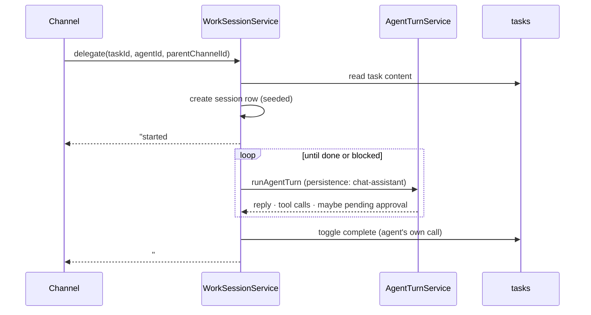

# Work sessions

Status: **phases 1–2 built** (2026-08-01) — schema, service, IPC, and turns
inside a session. Phases 2–4 (report-back, a delegate tool, UI) are still
proposals. Two claims in the original proposal were wrong and are corrected
below, marked ~~struck~~.

## The problem, from a real run

On 2026-08-01 an agent (`Claude for Enclave`) delegated an 11-item work order
to another agent (`Ornith`) in `#general`. What followed, in the channel:

```
Claude:  @Ornith — I've added 11 pre-release tasks… use list_tasks to pull
         them, work through them in priority order…
Ornith:  [tool] list_tools · enable_tool · list_tasks
         "Got them! Three P1s — let's dive in…"
Miz:     Please continue
Ornith:  [tool] list_tasks · list_tools · enable_tool · glob · list_directory
         "Let me start with #13… let me investigate the endpoint handling…"
```

Three distinct things went wrong, and only one of them is architectural.

1. **The assignment was prose in a channel.** The 11 items already existed as
   `tasks` rows, so the work order was overhead — Claude wrote it out, then
   told Ornith to `list_tasks` to get the real copy.
2. **The execution ran in the channel.** Every `glob`, every "let me
   investigate", every enable_tool became a channel message.
3. **The agent had nothing to work on.** `glob **/*.ts` returned 0 matches;
   `list_directory` on the project path returned `[]`. That is a missing repo
   binding, not a design flaw, and no architecture below fixes it.

Point 2 is the expensive one, and the reason is specific to how channels
replay. `perspectiveShiftMessages` flattens the whole channel history into
every participant's context on every turn (`src/main/utils/perspectiveShift.ts`).
So a forty-step task is not forty messages once — it is forty messages
re-read by every agent in the room, on every subsequent turn, permanently.
The room is a broadcast medium; using it as a workbench charges everyone
rent for one agent's scratch work.

## What a work session is

A container for one agent doing one task, with its own history, that reports
to the channel that asked for it.

```mermaid
flowchart LR
    subgraph Channel["#general — a room"]
        A["Claude: @Ornith take #13"]
        B["Ornith: started #13 ↗"]
        C["Ornith: #13 done — summary"]
    end

    subgraph Session["work session — a bench"]
        S1["seed: task #13 + pointer back"]
        S2["turn · turn · turn…<br/>tool calls, dead ends, retries"]
        S3["result"]
    end

    Task[("tasks row #13")]

    A -->|delegate| Task
    Task -->|seeds| S1
    S1 --> S2 --> S3
    B -.->|"announces"| Session
    S3 -->|"one message"| C

    style Session fill:#1f2937,stroke:#4b5563
```



The channel sees two messages. The session holds the other forty. Neither
history is ever replayed into the other — the only crossing is the report.

## Data model

A session is a `channels` row, like everything else since the v52 collapse.
That buys the whole message substrate for free: `messages` rows,
`responseMessages` persistence, branch/regenerate, the turn core's existing
`chat-assistant` persistence policy, and — because it is a real conversation —
the ability to open it, read it, and steer it.

Two additive columns:

| column | purpose |
|---|---|
| `task_id TEXT REFERENCES tasks(id) ON DELETE SET NULL` | what this session is for; its presence is what makes a row a session |
| `parent_channel_id TEXT REFERENCES channels(id) ON DELETE SET NULL` | where to report back; NULL for a session started from the task list directly |

**Resolved: a real `type='work'`** (migration v71), rather than overloading
`type='direct'` and teaching every chat query to exclude sessions. The cost was
a one-time SQLite table rebuild — `channels` is a foreign-key parent, so the
drop had to run with enforcement off or it would have cascaded through
`messages`. The benefit is that "rooms" is now one rule (`roomsOnly()` in
ChannelRepository) instead of a condition each caller has to remember.

## Lifecycle



**The seed is the design decision that matters.** A session starts with the
task content and a pointer to the originating message — *not* the channel
history. That is where the token win comes from; seeding with the channel
transcript would reproduce the problem inside a new container.

## How it meets what already exists

- **Turn core** — ~~unchanged~~ **one line changed**. A session turn is
  `persistence: 'chat-assistant'` against the session's container id, and no
  new policy was needed — but the core loaded its container through
  `getDirectChatById`, which filters `type='direct'`, so a session could not be
  loaded at all. It now calls `getConversationById` (direct **or** work); the
  chat IPC surface keeps the narrow method and never sees sessions.
- **Branch/tree gate** — widened, and this was not anticipated. Branch ops were
  gated to `type='direct'`, and the *message read path* runs through that gate,
  so a session could not read its own transcript. It now admits one-agent
  conversations: a session is one agent and one human on a linear thread, so
  regenerate and swipe mean there what they mean in a 1:1. Rooms are still
  refused (branching a shared room remains deferred product design).
- **Approvals** — a session is **interactive**, so approval-gated tools are
  *not* stripped. `nonInteractive` gating in `ai.ts` exists for routines and
  workflow nodes that cannot service a prompt; a session can, because a human
  can open it. The registry already keys on `{ context: 'chat' | 'channel',
  contextId }`, which works unchanged if sessions are `direct`-typed rows.
  **But**: an approval raised in a session nobody is watching stalls
  silently, so a pending approval must also surface to the parent channel.
  That is a report-back case, not just a completion case.
- **Report-back** — the report is an ordinary channel message via
  `ChannelRepository.createMessage` + the existing `channel-message-added`
  push. Under ADR-001 it is a **chain root** (depth 0), like
  `channel_send_message`: mentions inside a report can dispatch, and the
  report itself is not a reply to anything.
- **Tasks** — the session binds to a `tasks` row. Completion stays the agent's
  own `toggle_task` call; the session does not silently mark work done.
- **Workflows / routines** — unchanged and still the right home for
  *unattended, structured* execution. A workflow is a DAG of typed nodes; a
  work session is open-ended agent work with a human able to lean in. A
  session that runs unattended on a schedule is a routine, and should be built
  as one rather than as a session mode.

## Proposed invariants

1. Session history is never replayed into a channel, and channel history is
   never replayed into a session. The only crossing is a report message.
2. A session has exactly one agent and at most one task.
3. Nothing on the EventBus starts a session turn (ADR-001 holds unchanged).
4. Approval-gated tools stay available in sessions; a pending approval is
   reported to the parent channel, not just left in the session.
5. A session is readable and resumable by the user at any time — it is a
   conversation, not a job record.

## Deliberately not in scope

- **Autonomous multi-task runs.** One session, one task. "Work the whole
  backlog" is a routine driving a workflow.
- **Threading inside channels.** Considered and rejected for now: it needs a
  parent/child notion in `messages` plus replay rules for what a participant
  sees, and it leaves the work in the room by default.
- **Sub-agents spawning sub-sessions.** Depth control is a separate problem;
  the dispatcher's chain-depth machinery does not cover this and should not be
  reused blindly.

## Open questions

2. Does a session report progress at intervals, or only on
   completion/blocked/approval-needed?
3. One session per task forever, or a new session per attempt (re-run after a
   failed pass)?
4. Can any agent delegate to any other, or does delegation need a human in the
   loop the first time?
5. What does the UI surface — a session list, or only the entry point from a
   task and the channel report?

## If this is built

Suggested order, each independently useful:

1. ~~Schema + `WorkSessionService` with manual start from a task.~~ **Done.**
   Isolation verified live: a session seeded from a
   task ran a real turn and never saw a canary message sitting in its parent
   channel, and appears in neither the channel list nor the chat list.
2. ~~Report-back to a parent channel (start, done, blocked-on-approval).~~
   **Done.** Completion is explicit — a `complete_work_session` tool, offered
   only inside a session — because it cannot be inferred: a session is
   multi-turn, so a quiet turn is an agent thinking, not an agent finished.
3. A `delegate_task` agent tool, so `@Ornith take #13` creates the session
   instead of prose instructions.
4. UI: open a session from the task and from the channel report.
